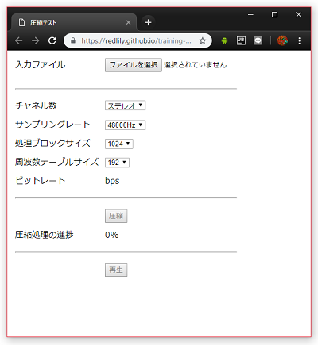

# Webで動作する音声圧縮の実証実験

## 概要

修正離散コサイン変換 (Modified Discrete Cosine Transform : MDCT) を使用したWebブラウザ上でJavaScriptを使用して
現実的な時間のエンコード、デコード可能な軽量な音声圧縮フォーマットの開発を目的とした実証実験用のプログラムです。

## Webアプリケーション

https://redlily.github.io/training-webaudio-compression

### 使い方

1. 音声ファイル(おすすめは無圧縮)を選択してデータを読み込ませます。
1. 圧縮オプションを選び圧縮を実行、数秒から数十秒で圧縮が完了します。
1. 圧縮が完了すると再生ボタンとダウンロードリンクが有効になります。
1. 再生を押すと圧縮データの再生を開始、ダウンロードを押すと圧縮データのダウンロードを行います。
1. 圧縮したデータはこのプログラムでデータ読み込み、再生が出来ます。

## データフォーマット

### ヘッダ

|変数名|型|説明|
|:---|:---|:---|
|MAGIC_NUMBER|UINT32|マジックナンバー、"WAM0"が固定値|
|DATA_SIZE|UINT32|データのバイトサイズ|
|DATA_TYPE|UINT32|拡張用のデータタイプ、"SMD0"が固定値|
|VERSION|UINT32|データのバージョン|
|SAMPLING_RATE|UINT32|サンプリングレート|
|CHANNEL_SIZE|UINT32|チャネル数、1がモノラル、2がステレオ|
|SAMPLE_COUNT|UINT32|データに含まれるサンプル数|
|FREQUENCY_RANGE|UINT16|周波数ブロックのサイズ|
|FREQUENCY_UPPER_LIMIT|UINT16|周波数ブロックの上限値|
|FREQUENCY_TABLE_SIZE|UINT16|周波数テーブルのサイズ|
|-|UINT16|バイトアライメント調整用の領域、今後の拡張次第では何か数値が入るかも|
|FRAME_COUNT|UINT32|データに含まれるフレーム数|
|FRAME_DATA|FRAME[CHANNEL_SIZE * FRAME_COUNT]|フレーム配列、チャネル数が2の場合、左、右とフーレムが並ぶ|

#### フレーム

|変数名|型|説明|
|:---|:---|:---|
|MASTER_SCALE|UINT32|このフーレムの主音量|
|SUB_SCALES|UINT4[8]|8つの周波数帯用の音量を調整するためのスケール値|
|ENABLE_FREQUENCIES|1bit[FREQUENCY_UPPER_LIMIT] or ceil(log_2(FREQUENCY_UPPER_LIMIT))bit [FREQUENCY_UPPER_LIMIT]|周波数の有効無効を収納した1bitのフラグ配列、もしくは有効な周波数のインデックスを収納した配列 バイト数の小さい方を使用し4バイトアライメントに適合するサイズにする|
|FREQUENCY_VALUES|4bit[FREQUENCY_TABLE_SIZE]|有効な周波数の対数で符号化された数値|
